Hi there 👋

About Me

- 🔭 Main use: Python，C++
- 📫 E-mail: 2327667836@qq.com
- 👯 About me: 摸鱼快乐~
- 🌐 Languages: English, 中文

<a>
  </img>
</a>
<a>
   </img>
</a>
<a>
   </img>
</a>
<a>
   </img>
</a>

